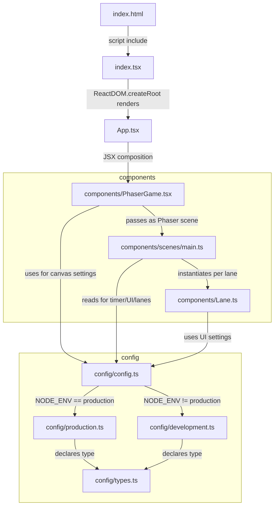

# typing-game-a

ブラウザで遊べるタイピングゲームです。

## 遊び方

Start ボタンを押してゲームを開始します。

3つのレーンに分かれており、異なる単語が並行で出題されます。
最初は左端が「アクティブ」なレーンです。アクティブなレーンの単語をタイプすると、スコアが加算されます。
レーンには数字が割り当てられており、それを入力することでアクティブなレーンを切り替えられます。
各レーンには独立のカウントダウンタイマーがついており、どれか一つでも時間が無くなるとゲームオーバーです。
時間内にできるだけ多くの単語をタイプしましょう。

ゲーム終了後に Retry ボタンで再挑戦できます。

## 構成図

大まかなファイル構成は下記です。 (Codex により出力)

